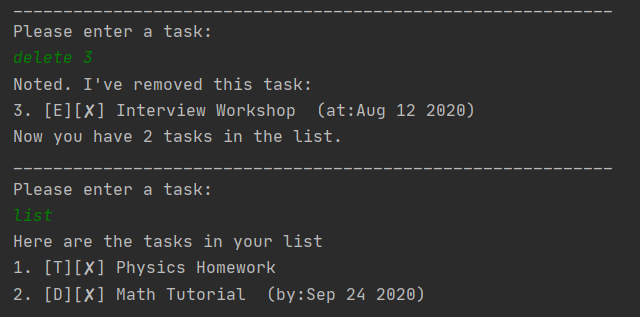

# Duke project template

This is a project template for a greenfield Java project. It's named after the Java mascot _Duke_. Given below are instructions on how to use it.

## Setting up in Intellij

Prerequisites: JDK 11, update Intellij to the most recent version.

1. Open Intellij (if you are not in the welcome screen, click `File` > `Close Project` to close the existing project dialog first)
1. Set up the correct JDK version, as follows:
   1. Click `Configure` > `Structure for New Projects` and then `Project Settings` > `Project` > `Project SDK`
   1. If JDK 11 is listed in the drop down, select it. If it is not, click `New...` and select the directory where you installed JDK 11
   1. Click `OK`
1. Import the project into Intellij as follows:
   1. Click `Open or Import`.
   1. Select the project directory, and click `OK`
   1. If there are any further prompts, accept the defaults.
1. After the importing is complete, locate the `src/main/java/Duke.java` file, right-click it, and choose `Run Duke.main()`. If the setup is correct, you should see something like the below:
   ```
   Hello from
    ____        _        
   |  _ \ _   _| | _____ 
   | | | | | | | |/ / _ \
   | |_| | |_| |   <  __/
   |____/ \__,_|_|\_\___|
   ```

## Usage

To add a todo task to the list:

    todo {task to be added}

To add a deadline task to the list:

    deadline {task to be added} / by: {YYYY-MM-DD}

To add an event task to the list:

    event {task to be added} / at: {YYYY-MM-DD}

To list out all tasks containing a keyword:

    find {keyword}

To list out all tasks currently in the list:

    list

To delete a task from the list:
* Use `list` to obtain the index of each task


    delete {index of the task to be deleted}

To mark a task in the list as completed:
* Use `list` to obtain the index of each task


    done {index of the task to be mark as completed}

To exit Duke program:

    bye

## Examples

#### todo


#### deadline


#### event


#### find


#### list


#### delete


#### done


#### bye
