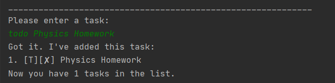
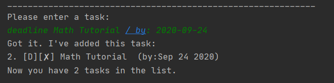
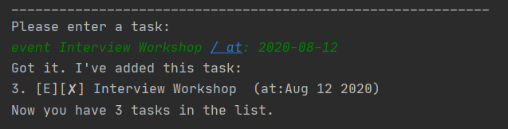
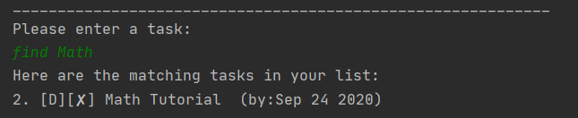
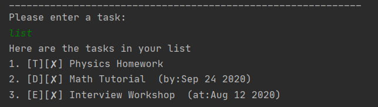
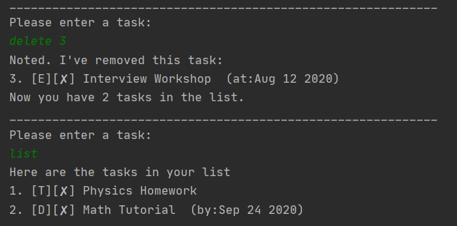
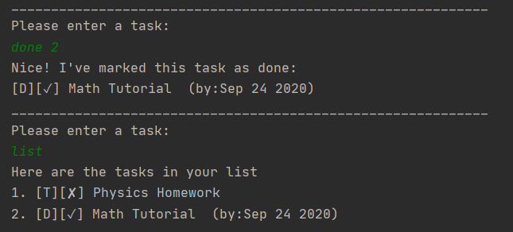
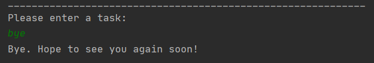

# User Guide

## Features 

#### Feature 1 
Duke keeps track of your tasks. 

You can add, delete or complete any tasks in your list.

#### Feature 2
Duke automatically saves your current task list and loads it the next time you enter the program.

## Usage

#### To add a todo task to the list:

    todo {task to be added}

#### To add a deadline task to the list:

    deadline {task to be added} / by: {YYYY-MM-DD}

#### To add an event task to the list:

    event {task to be added} / at: {YYYY-MM-DD}

#### To list out all tasks containing a keyword:

    find {keyword}

#### To list out all tasks currently in the list:

    list

#### To delete a task from the list:

    delete {index of the task to be deleted}

#### To mark a task in the list as completed:

    done {index of the task to be mark as completed}

#### To exit Duke program:

    bye

## Examples

### todo

### deadline

### event

### find

### list

### delete

### done

### bye

